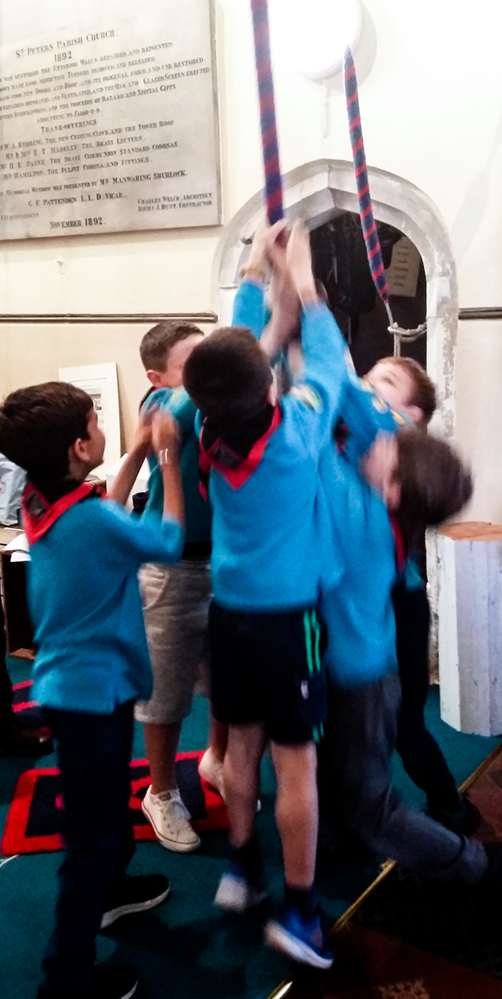
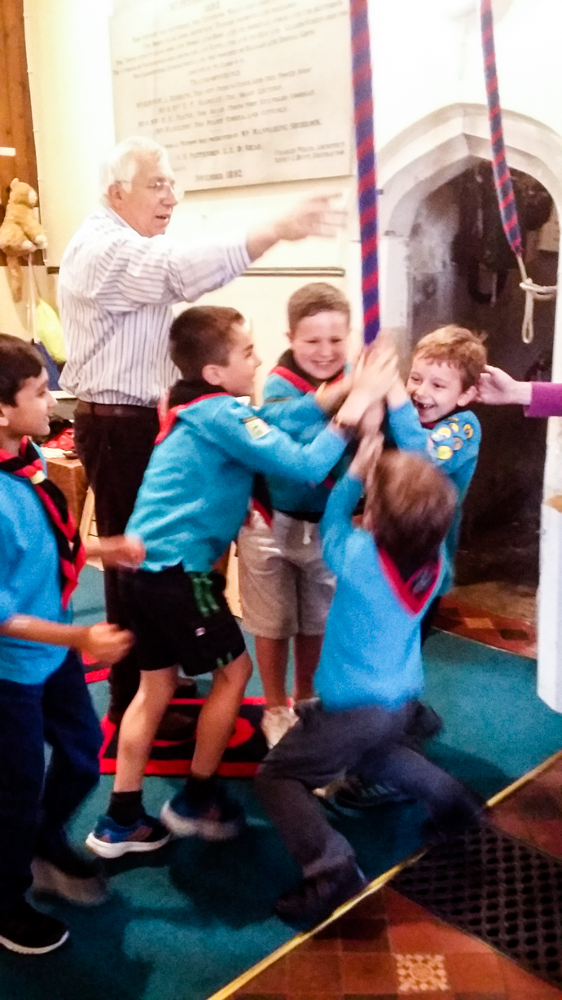
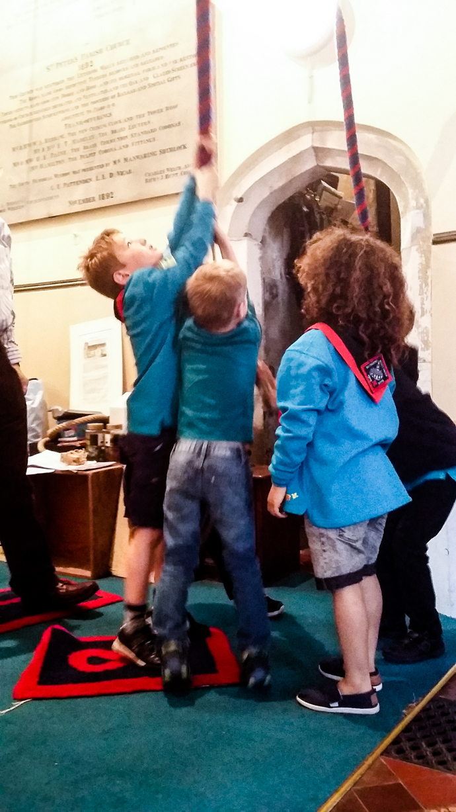
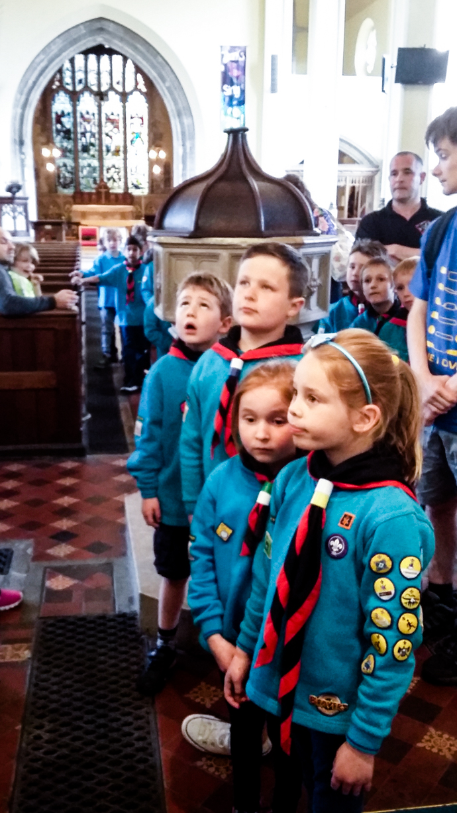
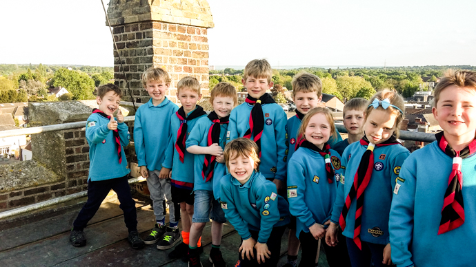
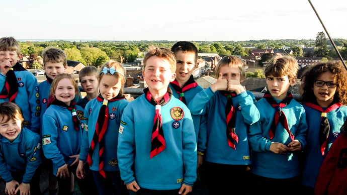
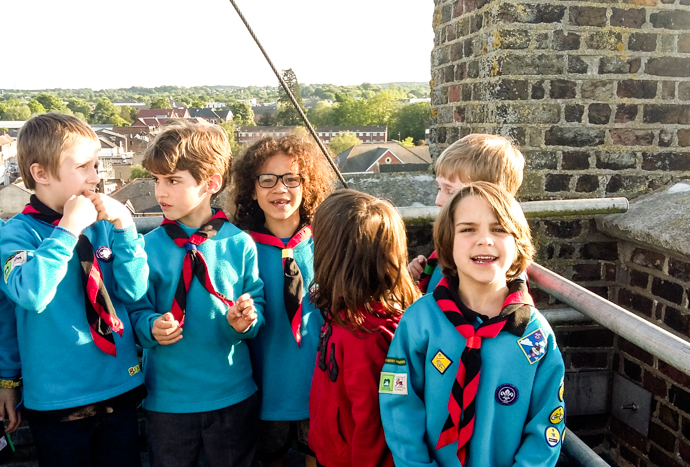
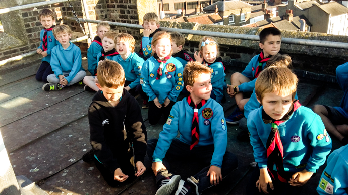

Abbey Beavers took on the challenge of climbing the tower of St Peter’s Church on Monday, with almost everyone making it to the very top to look out over the town!

Back on terra firma, they got the chance to ring the bells, under the tutelage of Tower Captain, and experienced bellringer Malcolm Loveday.

