The preparations for the Black Cherry Fair are nearly complete.

A big thank you to all those who have helped prepare the float and costumes for the parade. It will look great!

Some photos taken over the past week, showing the creation of this masterpiece:

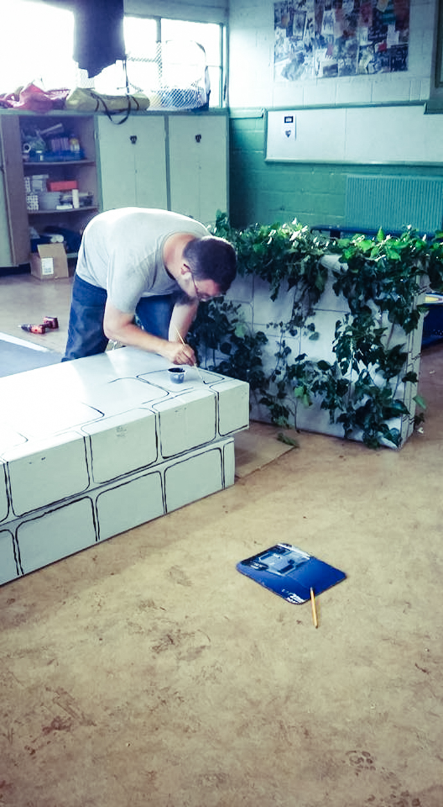
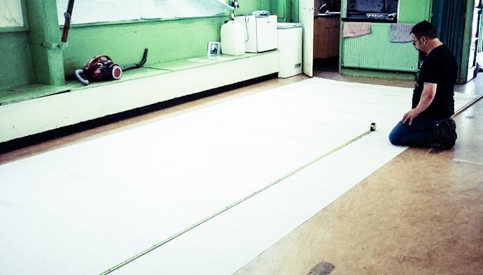
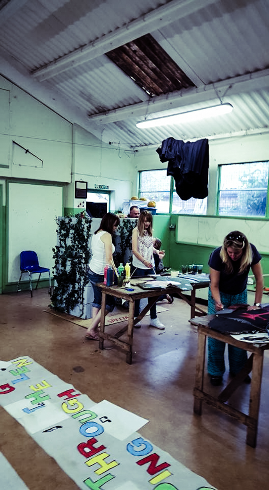
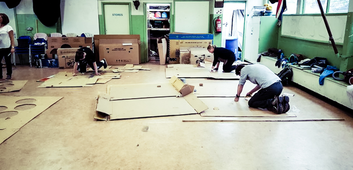
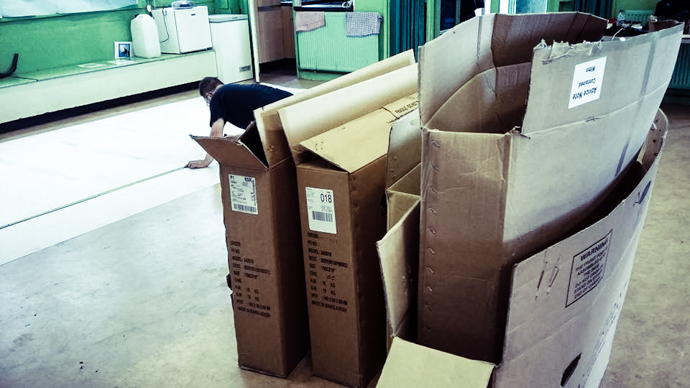
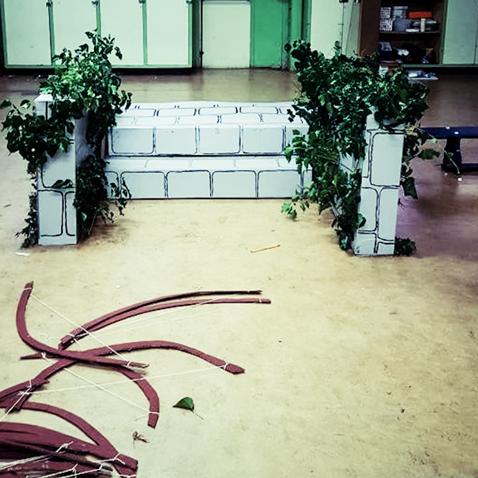
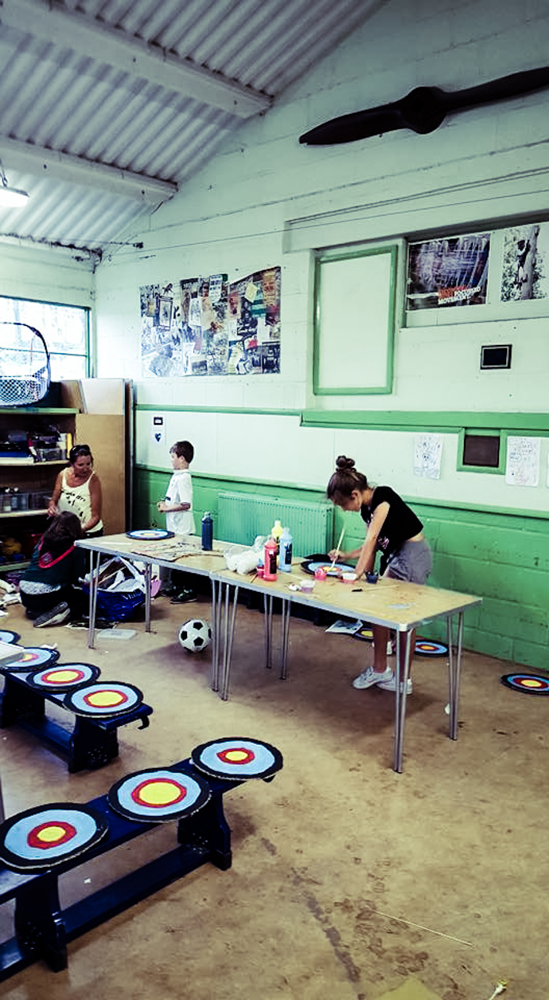
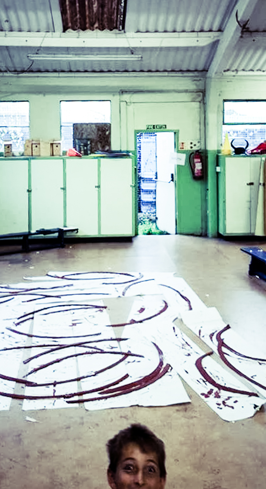
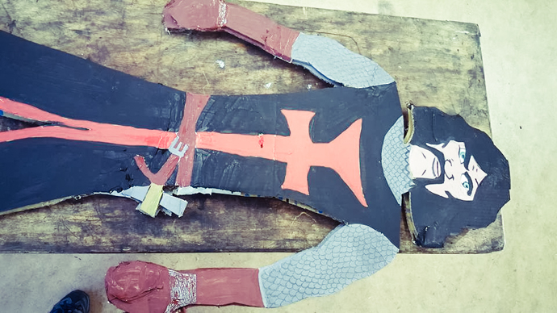
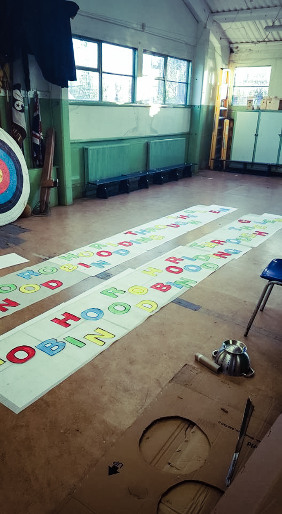
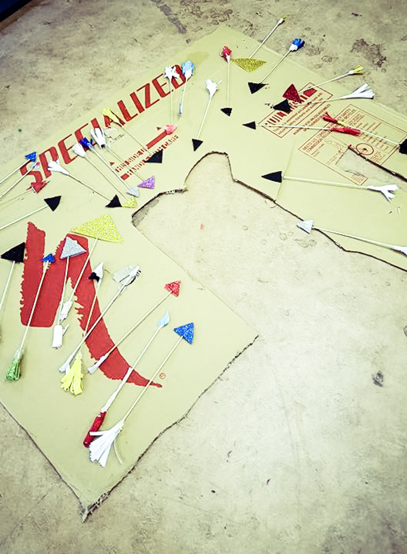
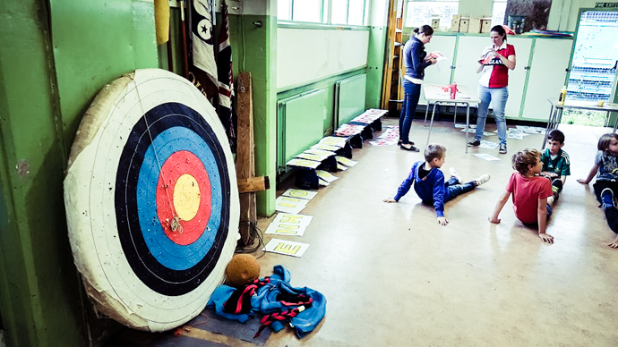
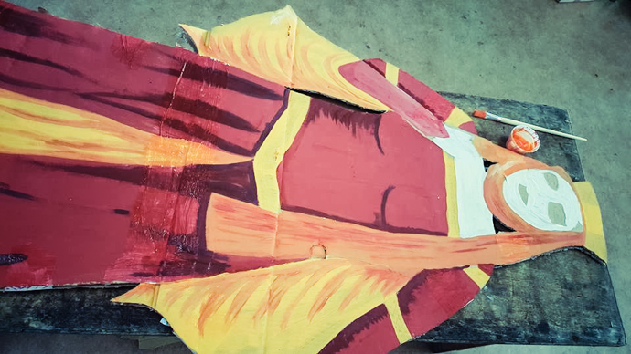
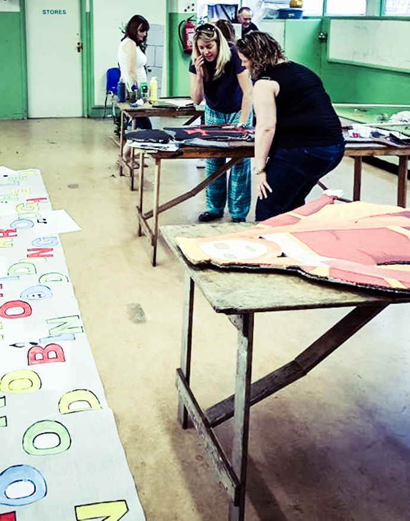
