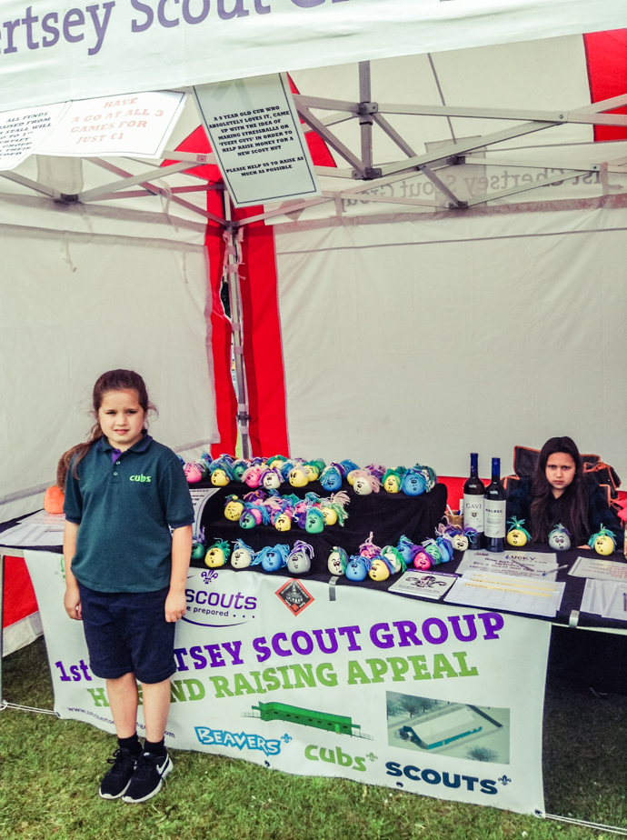
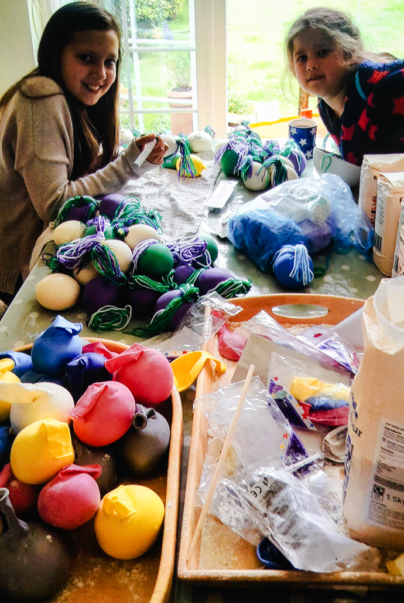

One industrious Cub (Charlotte; Dons) decided to do her best to help raise funds for the new HQ. Charlotte ran a stall at Lyne Village Fete, selling novelty items as well as some fun games. A brilliant effort, raising a total of £322!!!

Well done Charlotte and friends. You are a credit to the Group.

