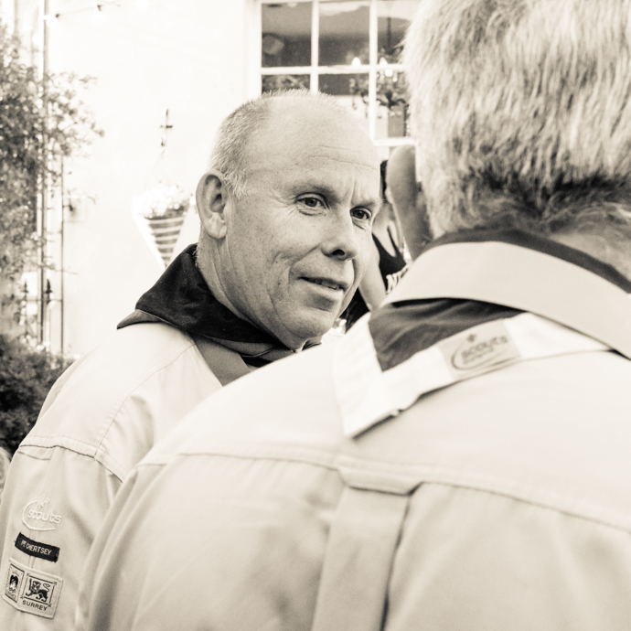
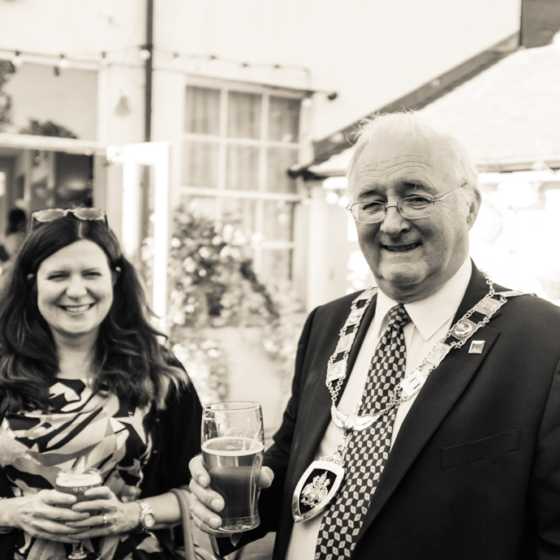
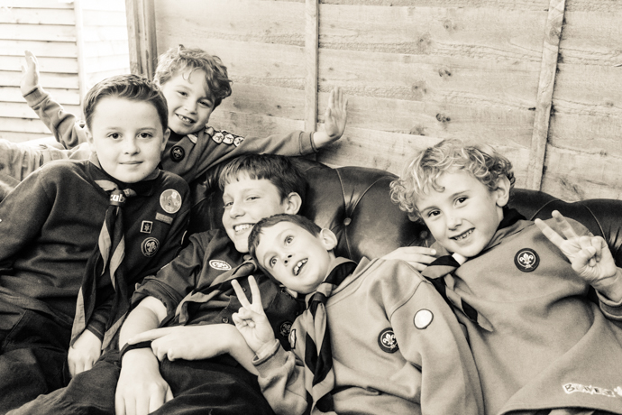

The generous patrons and friends of Thyme at the Tavern kindly chose 1st Chertsey Scout Group as the recipient of a whopping £2500 donation, raised through several events in the past year.

Mayor of Runnymede Cllr Alan Alderson and Runnymede Scouts District Commissioner Andy Sainsbury-Brown joined members of the Group to mark the occasion and receive the donation from landlords Robert and Tracey Palmer-Hall. The Group has used the money to purchase several new pieces of much-needed equipment to support camps and community events, including patrol tents, benches, tables and a new bain-marie.

A huge Scouting thanks to all those who contributed to the fundraising at Thyme at the Tavern!

