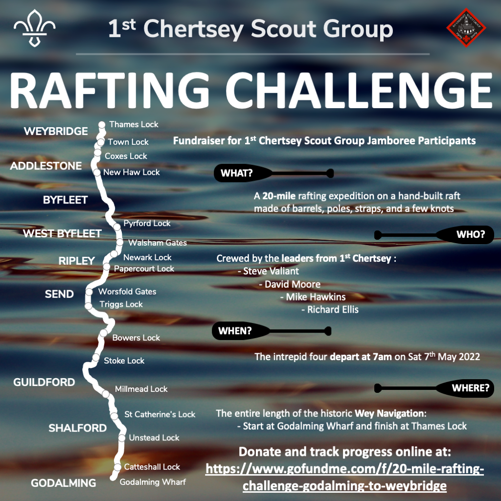

A fundraiser for 1st Chertsey Scout Group Jamboree Participants

A fundraiser to support our Scout Group and our young people that are participating in the 25th World Scout Jamboree.

20 miles. That’s a lot of paddling!

Crew: Capt. Steve ‘The Viking’ Valiant / David Moore / Mike Hawkins / Richard Ellis

The intrepid four depart at 7am on Sat 7th May 2022

Donate to this fundraiser here:
[Wey Navigation Rafting Challenge](https://www.gofundme.com/f/20-mile-rafting-challenge-godalming-to-weybridge)

